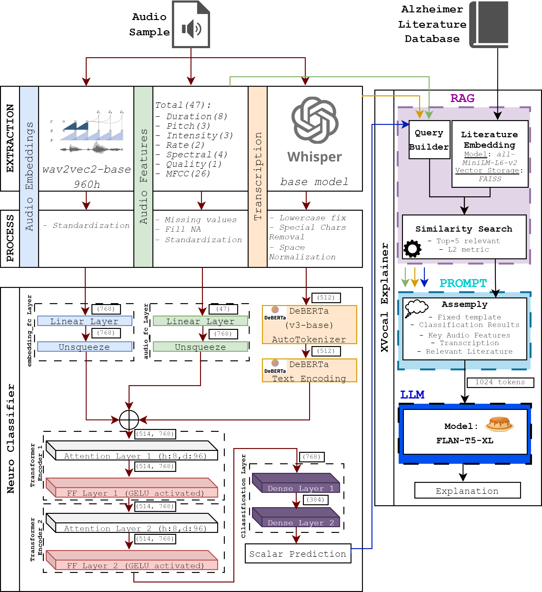
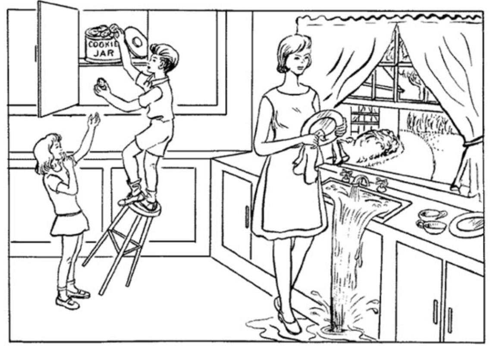

# 🔊🎙️NeuroXVocal🖥️🩺

<p align="center">

</p>

## 🧠⚙️[A] Neuro Training & Inference

<p align="center">

<br>
<em>The Cookie Theft picture from the Boston Diagnostic Aphasia Examination (Goodglass, Kaplan, & Barresi, 2001)</em>
</p>

First of all install all the necessary requirements:
```
pip install -r requirements_cls.txt
```
For the training of the classifier data from the [IS2021 ADReSSo Challenge](https://edin.ac/3p1cyaI) was used. Initial form of data was audio files of .wav format.

The data should be organized in the following structure for the succesfull training following Steps I and II of data preparation.

```
train
    ├── ad
    │   ├── {patient_id1}.txt
    │   └── {patient_id2}.txt
    │   └── {patient_id...}.txt
    │   └── audio_embeddings_ad.csv 
    │   └── audio_features_ad.csv            
    ├── cn
    │   ├── {patient_id1}.txt
    │   └── {patient_id2}.txt
    │   └── {patient_id...}.txt
    │   └── audio_embeddings_cn.csv 
    │   └── audio_features_cn.csv 
```
### I. Data extraction

1. Extract text from audio:
```
python src/data_extraction/transcribe_audio.py --path/to/audio/files
```
2. Extract audio features:
```
python src/data_extraction/extract_audio_features.py --path/to/audio/files --output_csv --path/to/create/the/audio_features.csv  
```
3. Extract audio embeddings:
```
python src/data_extraction\extract_audio_embeddings.py --path/to/audio/files --path/to/create/the/audio_embeddings.csv  
```
### II. Data process

1. Text processing:
```
python src/data_processing/preprocess_texts.py --path/to/txt/files --path/to/save/processed/txt/files
```
2. Audio features processing using scaler params:
```
python src/data_processing/preprocess_audio_features.py --path/to/audio_features.csv --path/to/save/processed/audio_features.csv --scaler_path src/inference/scaler_params_audio_features.pkl 
```
3. Audio embeddings processing using scaler params:
```
python src/data_processing/preprocess_audio_emb.py --path/to/audio_embeddings.csv --scaler_path src/inference/scaler_params_audio_emb.pkl --path/to/save/processed/audio_embeddings.csv
```
### III. Neuro Training

After setting up the values in src/train/config.py run:

```
python src/train/main.py  
```

### IV. Neuro Inference

After saving the trained model in the results folder, fix the paths in *src/inference/single_inference.py* and try the inference for a single patient based on patient's **processed** files:

```
python src/inference/single_inference.py
```

## [B] 🔍💬 XVocal RAG-Enhanced LLM Explainer Built

First of all, on top of *requirements_cls.txt* install all the necessary requirements:
```
pip install -r requirements_exp.txt
```

The data should be organized in the following structure as previously.

```
train
    ├── ad
    │   ├── {patient_id1}.txt
    │   └── {patient_id2}.txt
    │   └── {patient_id...}.txt
    │   └── audio_features_ad.csv            
    ├── cn
    │   ├── {patient_id1}.txt
    │   └── {patient_id2}.txt
    │   └── {patient_id...}.txt
    │   └── audio_features_cn.csv
```
### I. Data preparation - Literature

1. Ensure the literature folder exists at the specified path :`src\explainer\literature`

2. Add there as many research paper you wish in *.txt* form. For our needs the following papers were added, manually cleaned from titles, authors and references:

    1. *Fraser, K. C., Meltzer, J. A., & Rudzicz, F. (2016). Linguistic features identify Alzheimer's disease in narrative speech. Journal of Alzheimer's Disease, 49(2), 407-422.*

    2. *Tóth, L., Hoffmann, I., Gosztolya, G., Vincze, V., Szatlóczki, G., Bőhm, B., ... & Pakaski, M. (2018). Speech recognition-based classification of mild cognitive impairment and dementia. Lecture Notes in Computer Science, 11096, 89-98.*

    3. *Ahmed, S., Haigh, A. M., de Jager, C. A., & Garrard, P. (2013). Connected speech as a marker of disease progression in autopsy-proven Alzheimer's disease. Brain, 136(12), 3727-3737.*

    4. *Forbes-McKay, K. E., Shanks, M. F., & Venneri, A. (2013). Charting the decline in spontaneous writing in Alzheimer's disease: a longitudinal study. Acta Neuropsychiatrica, 25(6), 320-327.*

    5. *Taler, V., & Phillips, N. A. (2008). Language performance in Alzheimer’s disease and mild cognitive impairment: A comparative review. Journal of Clinical and Experimental Neuropsychology, 30(5), 501–556.*

    6. *König, A., Satt, A., Sorin, A., Hoory, R., Toledo-Ronen, O., Derreumaux, A., & Robert, P. H. (2018). Automatic Speech Analysis for the Assessment of Alzheimer's Disease: A Review. Journal of Alzheimer's Disease Reports, 2(1), 1-15.*

    7. *Ding, K., Chetty, M., Noori Hoshyar, A. et al. Speech based detection of Alzheimer’s disease: a survey of AI techniques, datasets and challenges. Artif Intell Rev 57, 325 (2024).*

    8. *Qi, X., Zhou, Q., Dong, J., & Bao, W. (2023). Noninvasive automatic detection of Alzheimer's disease from spontaneous speech: a review. Frontiers in Aging Neuroscience, 15.*

    9. *Chen J, Ye J, Tang F, Zhou J. Automatic Detection of Alzheimer's Disease Using Spontaneous Speech Only. Interspeech. 2021 Aug-Sep;2021:3830-3834. doi: 10.21437/interspeech.2021-2002. PMID: 35493062; PMCID: PMC9056005.*
    
    10. *Agbavor F, Liang H (2022) Predicting dementia from spontaneous speech using large language models. PLOS Digital Health 1(12): e0000168.*

### II. Path Configuration

Before running the system, ensure that the paths in the following Python files are correctly set to match your local environment:

```
1. src/explainer/data_loader.py
2. src/explainer/main.py
```

### III. XVocal Explanation Generation

Execute the main script with the desired `patient_id` to generate explanations based on our data folder structure:

```
python src/explainer/main.py --patient_id {patient_id}
```

**Example Output:**

The system will process the specified patient's data and generate an explanation by integrating their speech data with relevant literature findings.

```
Using device: gpu/cpu
Found N literature files in src/explainer/literature
Loaded N literature documents.
Explanation for Patient {patient_id}:
--------------------------------------------------------------------------------
The patient is probably an Alzheimer sample.
Based on the elevated speech pause ratio and increased number of pauses, it is indicative of cognitive decline commonly associated with Alzheimer's disease. The reduced articulation and speaking rates further support this diagnosis, aligning with findings from recent studies that link these speech patterns to AD progression. Additionally, the pitch and intensity variations observed may reflect underlying neurological impairments characteristic of Alzheimer's patients.
```